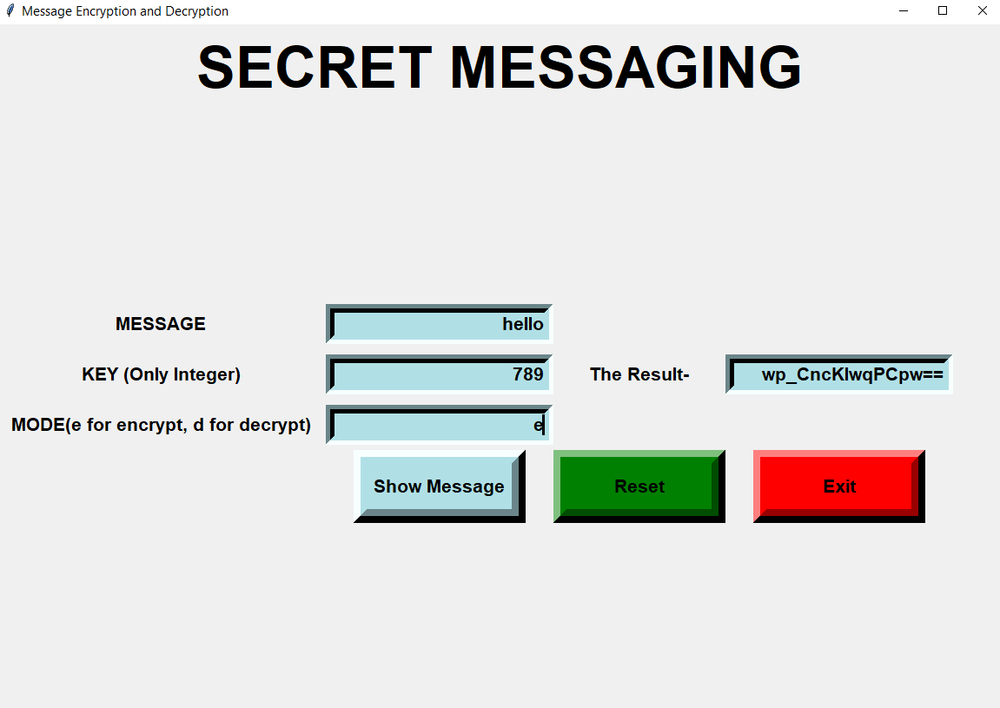
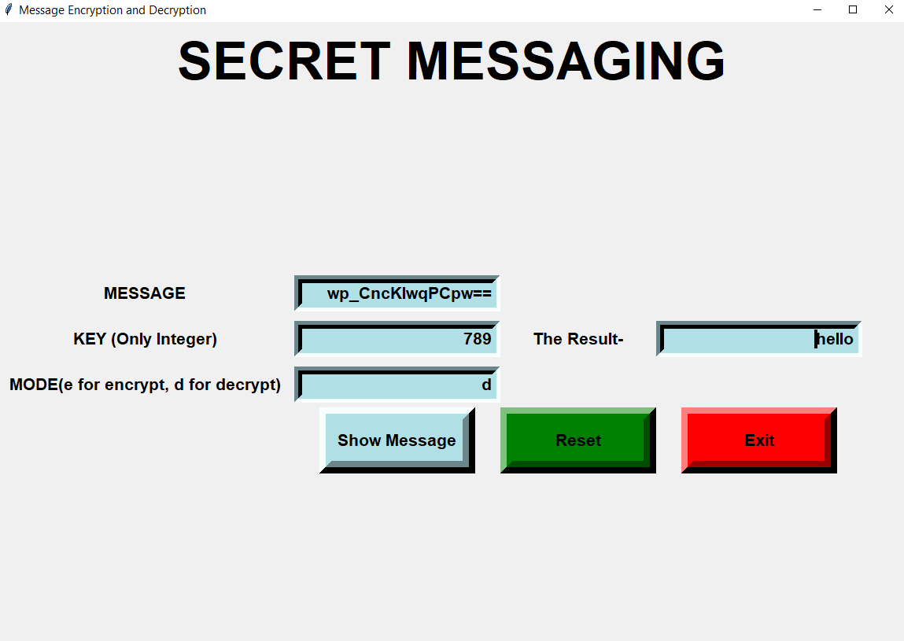

#  Encrypt-and-Decrypt

<h2> Live Demo: https://danish-uddin.github.io/Encrypt-and-Decrypt/ </h2>

Encryption is the process by which a readable message is converted to an unreadable form to prevent unauthorized parties from reading it.
Decryption is the process of converting an encrypted message back to its original (readable) format.
The original message is called the plaintext message

# Objective of this project
The main aim of this project is providing an easy to use user interface to encode a message using a key. It also provides the decryption function to decode the message using the same key

The following are some of the features provided by this project:

1. Encrypt/encode a message
2. Decrypt/decode an encrypted message

# Application Screenshots

### User Interface

### Encryption

### Decryption

